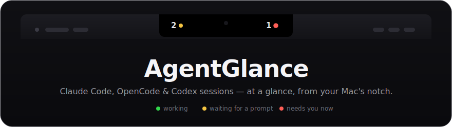

<p align="center">
  
</p>

**Know when your coding agents need you—without leaving the notch.**

AgentGlance is a quiet, native macOS indicator for Claude Code, OpenCode, Codex CLI, [Pi](https://github.com/badlogic/pi-mono), and [Convoy](https://github.com/Inakitajes/convoy) pipeline sessions. It lives around the MacBook notch — Convoy, Pi, Codex, and OpenCode on the left wing, Claude on the right — and returns you to the exact terminal tab or tmux pane with one click.

> **Preview status:** AgentGlance is pre-1.0 and currently distributed as source. The local build is ad-hoc signed; signed and notarized downloads will follow once the release pipeline is ready.

## Why AgentGlance?

- See only tools that currently have visible sessions, with official tool marks and session counts.
- Click a tool and its session menu grows out of the notch itself: status light, session title taken from the live terminal tab, project directory, git branch (worktrees included) or Convoy pipeline step, and elapsed time.
- Focus the recorded Ghostty, iTerm2, Terminal, or tmux session with one click.
- Expand any row (chevron or right click) for inline actions: rename the session, copy the project path, reveal it in Finder, or kill the process — SIGTERM with SIGKILL escalation — and close its exact tmux pane or Ghostty tab.
- Watch Convoy pipeline runs as first-class sessions: the current step in the row, red light on human gates, and no duplicate rows for the OpenCode sessions a pipeline owns.
- Closed terminals disappear immediately — kernel exit notifications, not polling.
- Keep all observation and state on your Mac.
- Run without telemetry, accounts, servers, or third-party Swift dependencies, at ~1% CPU and ~16 MB of memory.

## The traffic light

| Light | Meaning |
| --- | --- |
| 🟢 Green (menu only, radar ping) | Working — the agent is processing. The bar stays silent: working is the default hum, not an alert. |
| 🟡 Yellow, steady | Idle — the session waits at the prompt for your next input. |
| 🔴 Red, pulsing | Needs you — a question, a permission ask, or a failed pipeline step is waiting. |

The bar shows a dot only for waiting states; the menu always shows the real status per session. Visiting a waiting session — from the menu or by switching to its tab yourself — quiets its bar light until the session shows new activity.

## Requirements

- macOS 14 Sonoma or newer;
- a MacBook with a notch for the intended UI placement;
- Swift 6.0 or newer to build from source;
- Node.js 20+ to run the OpenCode and Pi behavioral tests;
- Ghostty 1.3+ with AppleScript enabled, iTerm2, or Terminal.

Apple Silicon is the tested development platform. Intel builds have not yet been validated.

## Install

One command builds the app, installs it into `/Applications`, wires the agent hooks, launches it, and verifies everything:

```bash
git clone https://github.com/ixjosemi/AgentGlance.git
cd AgentGlance
./scripts/install.sh
```

The same command reinstalls: it stops the running instance, replaces the app, relaunches, and re-verifies. The bundle is ad-hoc signed for local use — do not redistribute it as an official release.

Verify an existing installation at any time:

```bash
/Applications/AgentGlance.app/Contents/Resources/bin/agentglance doctor
```

```
✓ hook binaries: all executables present in ~/.agentglance/bin
✓ state directory: ~/.agentglance/state exists
✓ Claude Code hooks: all lifecycle hooks registered in ~/.claude/settings.json
✓ OpenCode plugin: ~/.config/opencode/plugins/agentglance.js matches the bundled file
✓ Codex notify: notify hook registered in ~/.codex/config.toml
✓ Pi extension: ~/.pi/agent/extensions/agentglance.ts matches the bundled file
```

`doctor` is read-only and exits non-zero when something is broken, so it is also usable from scripts.

### Manual build

For development without touching `/Applications`:

```bash
swift build
swift run agentglance-tests
./scripts/build-app.sh
open .build/AgentGlance.app
```

### What the hook installer does

Without integrations the app still detects running agents (via a fast libproc process scan), but every session shows as permanently working — the hooks are what feed real status changes. `install.sh` runs `agentglance install`, which:

- installs the CLI and hook scripts under `~/.agentglance/bin`;
- merges AgentGlance-owned Claude Code hooks into `~/.claude/settings.json`, preserving every existing setting and hook (the merge is idempotent);
- installs `~/.config/opencode/plugins/agentglance.js` only when it can do so safely;
- adds a Codex `notify` entry only when no notification command exists;
- installs the Pi extension `~/.pi/agent/extensions/agentglance.ts` only when it can do so safely.

Installation fails instead of replacing an unknown AgentGlance-named plugin. Integration directories may be symlinks — common in dotfile setups — as long as they resolve to a directory you own inside your home; `~/.agentglance` itself must be symlink-free because hooks execute binaries from it. Agents started before installing need a restart to pick up the hooks. OpenCode additionally loads plugins in its detached background service, which survives TUI restarts — after installing, run `pkill -f "opencode2 serve"` once; the next `opencode` starts a fresh service with the plugin loaded.

To remove integrations and local state:

```bash
/Applications/AgentGlance.app/Contents/Resources/bin/agentglance uninstall
```

Then quit AgentGlance and delete the app bundle. Review your Claude or Codex configuration if you manually modified AgentGlance entries after installation.

## Terminal focus

| Host | Focus strategy | Notes |
| --- | --- | --- |
| Ghostty | exact surface ID resolved by the process scan, then project/title fallback | Requires Ghostty 1.3+ |
| iTerm2 | native session ID | Uses iTerm2 AppleScript |
| Terminal | TTY | Uses Terminal AppleScript |
| tmux | validated pane ID, then host activation | `tmux` must be in a trusted standard install location |

macOS asks for Automation access the first time AgentGlance controls a terminal. If denied, enable it under **System Settings → Privacy & Security → Automation**.

## How it works

Claude hooks, an OpenCode plugin, a Pi extension, the Codex rollout watcher, the Convoy runs watcher, and a process fallback produce versioned session documents under `~/.agentglance/state`. The app observes that directory and renders active sessions. State is written atomically with user-only permissions. Convoy needs no hook at all: its run metadata under `~/.convoy/runs` is read directly, and a run is only shown while its recorded server process is verifiably alive.

Everything is event-driven and off the main thread: a libproc-based scanner (no subprocesses, ~2 ms per full sweep) runs on a 5-second heartbeat, kernel `EVFILT_PROC` exit watchers reap closed sessions instantly, and directory observation with debounce delivers state changes to the UI. Claude and OpenCode status changes land in well under a second; Codex and Convoy ride the heartbeat. Session titles follow the live Ghostty tab title — cleaned of status decorations and capped at 20 characters — and a manual rename (persisted in `~/.agentglance/session-names.json`) always wins. Agent matching accepts either the kernel-resolved executable path or `argv[0]`, so versioned symlink installs like `~/.local/bin/claude → …/versions/x.y.z` are detected correctly.

See [Architecture](docs/ARCHITECTURE.md) for the full data flow and trust boundaries.

## Privacy and security

AgentGlance has no networking or telemetry. It stores local session metadata—including project paths, process IDs, timestamps, and terminal identifiers—but not prompts or model responses. Read [PRIVACY.md](PRIVACY.md) before installing integrations and [SECURITY.md](SECURITY.md) before reporting a vulnerability.

Treat `agentglance debug` output as private because it includes session and project metadata:

```bash
/Applications/AgentGlance.app/Contents/Resources/bin/agentglance debug
```

## Known limitations

- Codex rollout formats are not a stable public contract; unknown lines are ignored and the notify hook is the reliable turn-complete signal.
- Same-directory Codex sessions can be ambiguous when upstream events provide no PID or terminal identifier.
- The app currently has no signed/notarized binary release, automatic updater, or Homebrew cask.
- The behavioral runner is an executable because the minimal Command Line Tools environment used during early development did not ship XCTest or Swift Testing. Run it with `swift run agentglance-tests`.

## Contributing

Read [CONTRIBUTING.md](CONTRIBUTING.md) and [AGENTS.md](AGENTS.md). New runtime behavior requires a failing behavioral test first. All pull requests must pass:

```bash
swift build
swift run agentglance-tests
./scripts/build-app.sh
```

## Trademark notice

AgentGlance is independent and is not affiliated with Anthropic, OpenAI, SST, Ghostty, Apple, or tmux. Product names and marks identify compatible tools only. See [NOTICE](NOTICE).

## License

[MIT](LICENSE) © 2026 Josemi Hernandez
